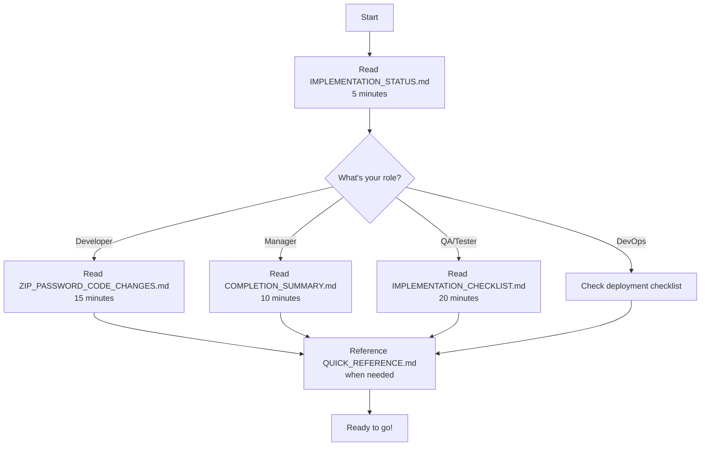

# ZIP Password Upload - Documentation Index

## 📍 Where to Find Everything

### ⭐ Start Here
**[IMPLEMENTATION_STATUS.md](IMPLEMENTATION_STATUS.md)** - 5 minute overview of what was fixed

---

## 📚 All Documentation Files

### By Read Time

| File | Read Time | Best For |
|------|-----------|----------|
| **IMPLEMENTATION_STATUS.md** | 5 min | Quick overview |
| **ZIP_PASSWORD_QUICK_REFERENCE.md** | 3 min | Quick lookup while working |
| **SOLUTION_SUMMARY.md** | 10 min | Complete understanding |
| **ZIP_PASSWORD_CODE_CHANGES.md** | 15 min | Understanding code changes |
| **ZIP_PASSWORD_IMPLEMENTATION_CHECKLIST.md** | 20 min | Verification and testing |
| **ZIP_PASSWORD_UPLOAD_FIX.md** | 20 min | Detailed reference |
| **DOCUMENTATION_README.md** | 5 min | How to use the docs |
| **COMPLETION_SUMMARY.md** | 10 min | Final summary |
| **VISUAL_SUMMARY.txt** | 5 min | Visual ASCII overview |

### By Purpose

#### Planning & Overview
- [IMPLEMENTATION_STATUS.md](IMPLEMENTATION_STATUS.md) - What was built
- [COMPLETION_SUMMARY.md](COMPLETION_SUMMARY.md) - What was accomplished
- [VISUAL_SUMMARY.txt](VISUAL_SUMMARY.txt) - Visual overview

#### Understanding the Solution
- [SOLUTION_SUMMARY.md](SOLUTION_SUMMARY.md) - Complete explanation
- [ZIP_PASSWORD_UPLOAD_FIX.md](ZIP_PASSWORD_UPLOAD_FIX.md) - Detailed reference

#### Code Changes
- [ZIP_PASSWORD_CODE_CHANGES.md](ZIP_PASSWORD_CODE_CHANGES.md) - Line-by-line diffs

#### Quick Lookup
- [ZIP_PASSWORD_QUICK_REFERENCE.md](ZIP_PASSWORD_QUICK_REFERENCE.md) - One-pager

#### Testing & Verification
- [ZIP_PASSWORD_IMPLEMENTATION_CHECKLIST.md](ZIP_PASSWORD_IMPLEMENTATION_CHECKLIST.md) - Test checklist

#### Navigation
- [DOCUMENTATION_README.md](DOCUMENTATION_README.md) - How to use these docs
- This file

---

## 🎯 By Role

### Developers
1. Read: [ZIP_PASSWORD_CODE_CHANGES.md](ZIP_PASSWORD_CODE_CHANGES.md) (15 min)
2. Reference: [ZIP_PASSWORD_QUICK_REFERENCE.md](ZIP_PASSWORD_QUICK_REFERENCE.md)
3. Verify: [ZIP_PASSWORD_IMPLEMENTATION_CHECKLIST.md](ZIP_PASSWORD_IMPLEMENTATION_CHECKLIST.md)

### Project Managers / Product Owners
1. Read: [IMPLEMENTATION_STATUS.md](IMPLEMENTATION_STATUS.md) (5 min)
2. Then: [COMPLETION_SUMMARY.md](COMPLETION_SUMMARY.md) (10 min)
3. Check: Deployment checklist

### QA / Test Engineers
1. Read: [ZIP_PASSWORD_IMPLEMENTATION_CHECKLIST.md](ZIP_PASSWORD_IMPLEMENTATION_CHECKLIST.md) (20 min)
2. Reference: [ZIP_PASSWORD_QUICK_REFERENCE.md](ZIP_PASSWORD_QUICK_REFERENCE.md)
3. API: See API endpoint section in any file

### DevOps / Release Managers
1. Read: [IMPLEMENTATION_STATUS.md](IMPLEMENTATION_STATUS.md) (5 min)
2. Check: Build status section
3. Reference: Deployment readiness section

---

## 🔍 By Topic

### What Was Fixed?
- [IMPLEMENTATION_STATUS.md](IMPLEMENTATION_STATUS.md) - "Problems Fixed"
- [ZIP_PASSWORD_UPLOAD_FIX.md](ZIP_PASSWORD_UPLOAD_FIX.md) - "Issues Fixed"

### How Was It Fixed?
- [ZIP_PASSWORD_CODE_CHANGES.md](ZIP_PASSWORD_CODE_CHANGES.md) - Entire file
- [SOLUTION_SUMMARY.md](SOLUTION_SUMMARY.md) - "Changes Made"

### How Do I Use the API?
- [IMPLEMENTATION_STATUS.md](IMPLEMENTATION_STATUS.md) - "API Usage"
- [ZIP_PASSWORD_UPLOAD_FIX.md](ZIP_PASSWORD_UPLOAD_FIX.md) - "API Usage"
- [ZIP_PASSWORD_QUICK_REFERENCE.md](ZIP_PASSWORD_QUICK_REFERENCE.md) - API examples

### How Do I Test It?
- [ZIP_PASSWORD_IMPLEMENTATION_CHECKLIST.md](ZIP_PASSWORD_IMPLEMENTATION_CHECKLIST.md) - "Testing Scenarios"
- [ZIP_PASSWORD_QUICK_REFERENCE.md](ZIP_PASSWORD_QUICK_REFERENCE.md) - "Testing the Fix"

### How Do I Deploy It?
- [IMPLEMENTATION_STATUS.md](IMPLEMENTATION_STATUS.md) - "Ready for Deployment"
- [ZIP_PASSWORD_IMPLEMENTATION_CHECKLIST.md](ZIP_PASSWORD_IMPLEMENTATION_CHECKLIST.md) - "Deployment Checklist"

### What Are the Limitations?
- [IMPLEMENTATION_STATUS.md](IMPLEMENTATION_STATUS.md) - "Known Limitation"
- [ZIP_PASSWORD_UPLOAD_FIX.md](ZIP_PASSWORD_UPLOAD_FIX.md) - "Notes"
- [ZIP_PASSWORD_IMPLEMENTATION_CHECKLIST.md](ZIP_PASSWORD_IMPLEMENTATION_CHECKLIST.md) - "Known Limitations"

---

## 📊 Quick Stats

| Metric | Value |
|--------|-------|
| Files Modified | 3 |
| Methods Changed | 4 |
| Lines Added (net) | ~42 |
| Compilation Errors | 0 ✅ |
| Build Time | 21 seconds ✅ |
| Backward Compatibility | 100% ✅ |
| Documentation Files | 9 |
| Total Documentation Lines | 2,000+ |

---

## 🚀 Quick Start

---

## 📝 File Descriptions

### IMPLEMENTATION_STATUS.md (5 min) ⭐
Quick overview of all 4 issues fixed. Good starting point for everyone.

### SOLUTION_SUMMARY.md (10 min)
Complete solution explanation with architecture, implementation details, and patterns used.

### ZIP_PASSWORD_CODE_CHANGES.md (15 min)
Detailed line-by-line code diffs with explanations. For developers who want to understand exact changes.

### ZIP_PASSWORD_QUICK_REFERENCE.md (3 min)
One-page quick lookup with tables and key facts. Keep this handy while working.

### ZIP_PASSWORD_IMPLEMENTATION_CHECKLIST.md (20 min)
Complete verification checklist, error scenarios, API docs, testing scenarios, and deployment readiness.

### ZIP_PASSWORD_UPLOAD_FIX.md (20 min)
Comprehensive reference guide with file naming conventions, error handling, and notes.

### DOCUMENTATION_README.md (5 min)
Guide on how to use these documentation files. Includes decision matrix by role and topic.

### COMPLETION_SUMMARY.md (10 min)
Final summary of what was accomplished, with highlights and next steps.

### VISUAL_SUMMARY.txt (5 min)
ASCII art visual overview of the implementation with all key information in boxes.

---

## 🎓 Learning Path

### For Managers
1. IMPLEMENTATION_STATUS.md
2. COMPLETION_SUMMARY.md
3. Deployment checklist

### For Developers
1. IMPLEMENTATION_STATUS.md
2. ZIP_PASSWORD_CODE_CHANGES.md
3. Keep ZIP_PASSWORD_QUICK_REFERENCE.md handy

### For QA/Testers
1. IMPLEMENTATION_STATUS.md
2. ZIP_PASSWORD_IMPLEMENTATION_CHECKLIST.md
3. Reference ZIP_PASSWORD_QUICK_REFERENCE.md

### For DevOps/SRE
1. IMPLEMENTATION_STATUS.md
2. Build & Deployment sections in any file
3. Monitoring/Logging sections

---

## 💡 Tips

1. **Use Ctrl+F** to search within these markdown files
2. **Keep the QUICK_REFERENCE open** while implementing/testing
3. **Check the checklists** before deployment
4. **Read role-specific sections** first
5. **Use the index links** to navigate

---

## 📞 Quick Help

**Need a 5-minute overview?**
→ Read IMPLEMENTATION_STATUS.md

**Need to understand code?**
→ Read ZIP_PASSWORD_CODE_CHANGES.md

**Need to verify everything?**
→ Read ZIP_PASSWORD_IMPLEMENTATION_CHECKLIST.md

**Need quick reference?**
→ Read ZIP_PASSWORD_QUICK_REFERENCE.md

**Need navigation help?**
→ Read DOCUMENTATION_README.md

---

**Last Updated:** January 4, 2026
**Status:** All documentation complete and organized

